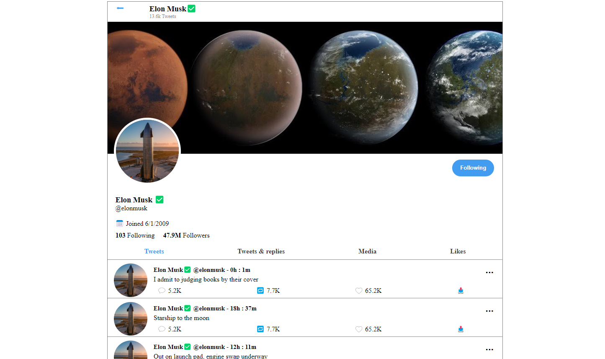

# dynamic-twitter app

# URL

https://boychapz.github.io/dynamic-twitter/?user=user1
https://boychapz.github.io/dynamic-twitter/?user=user2

# Story

used a mock JSON response to build a Twitter timeline and render as dynamic DOM elements and use JavaScript code to dynamically load profiles
so that we can read the query string from the URL and display results based on the used selected when passed in the browser.
in this case we have only 2 users (user1 and user2) so when we include "?user=user1" or " ?user=user2" in the browser it should display that user object.
The landing page will display user1 by default.

# ScreenShot

